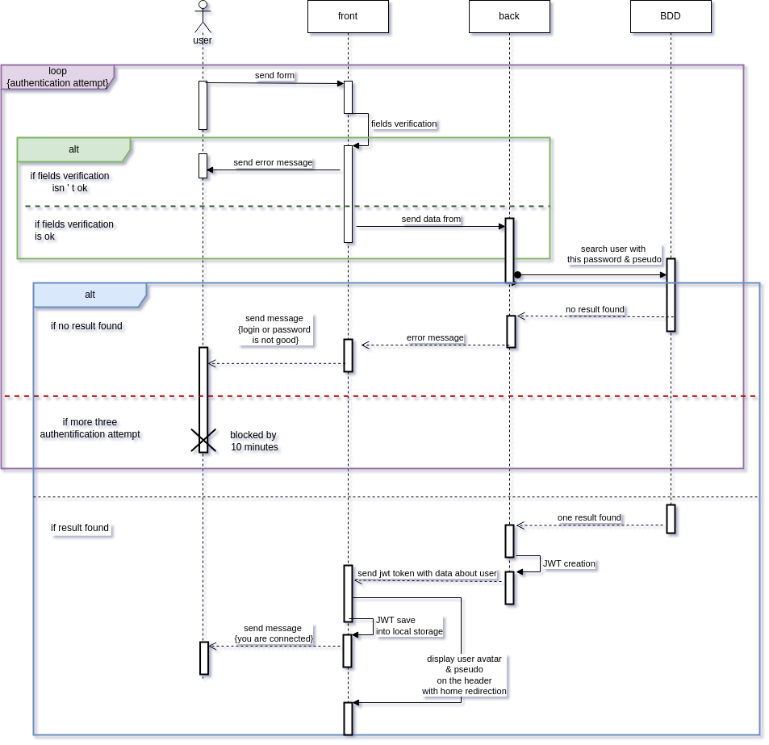

# 
 Séquences 

## Pourquoi ces diagrammes

Nous avons décidé d'utiliser ces diagrammes car il permet de décrire **COMMENT** les éléments du système interagissent entre eux et avec les acteurs :
- Les objets au coeur d'un système interagissent en s'échangeant des messages.
- Les acteurs interargissent avec le système au moyen d'IHM (Interface Homme-Machine).

## Explication des diagrammes

Nous avons l'utilisateur, l'administrateur, le "front", le"back" du site Cuistonaute ainsi que la BDD.

Il y a plusieurs séquences : 

## Image des diagrammes

### Séquence d'insciption :

  

### Séquence de connexion : 

  

### Séquence de création de recette : 

  

### Séquence de validation de reccette : 

  
