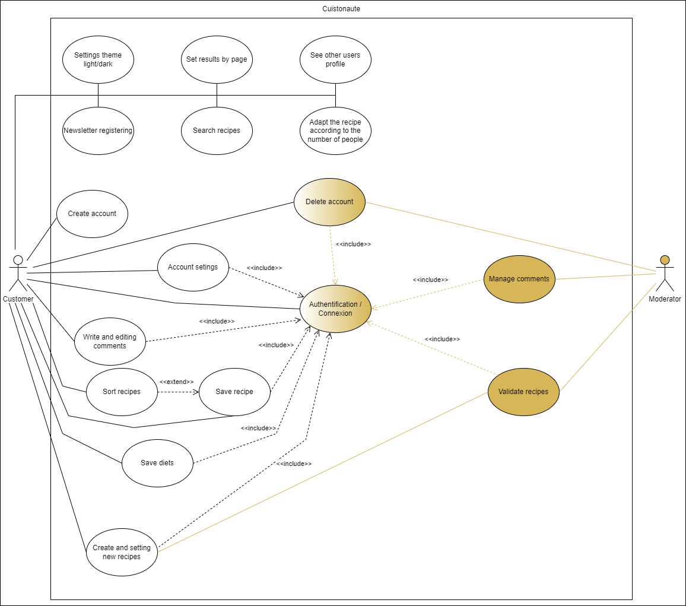

# 
 use case 

## Pourquoi ce diagramme

Nous avons décider d'utiliser ce diagramme car il sert à modéliser à **QUOI** sert le système, en organisant les interactions possibles avec les acteurs.

## Explication du diagramme

Nous avons en acteurs :
- l'utilisateur(possède un compte).
- le moderateur.

Nous avons en système : 
- le site Cuistonaute.

L'utilisateur peut sans avoir de compte:
- rechercher une recette.
- trier (avec enregistrement) les recettes.
- Adapter la composition de la recette en fonction du nombre de personnes
- voir le profil des autres utilisateurs par le biais de commentaire ou auteur d'une recette.
- gèrer le nombre de résultat des recettes par page.
- s'inscrire à la newletter.
- changer le thème.
- se connecter.
- modifier les paramétres de son comptes.
- supprimer son compte.
- créer des nouvelles recettes et la gèrer.
- possibilité de faire des commentaires et les gérer.
- enregistrer ses préférences culinaires.
- enregistrer une recette en favoris.

Le modérateur peut : 
- Modérer les recettes.
- Modérer les commentaires.
- Supprimer un compte utilisateur.
- possibilité de faire remonter des informations aux services adéquats(ex: police).

## Image du diagramme
 * Usecase diagram: 

  
